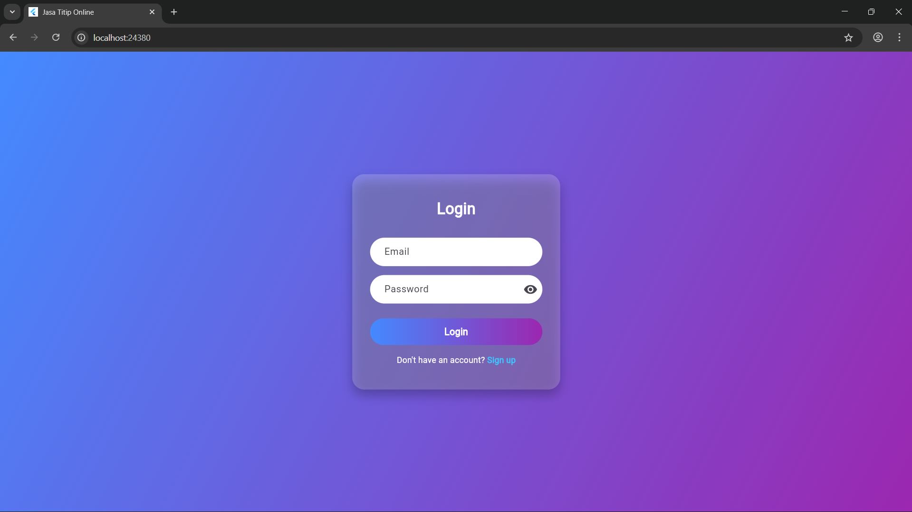
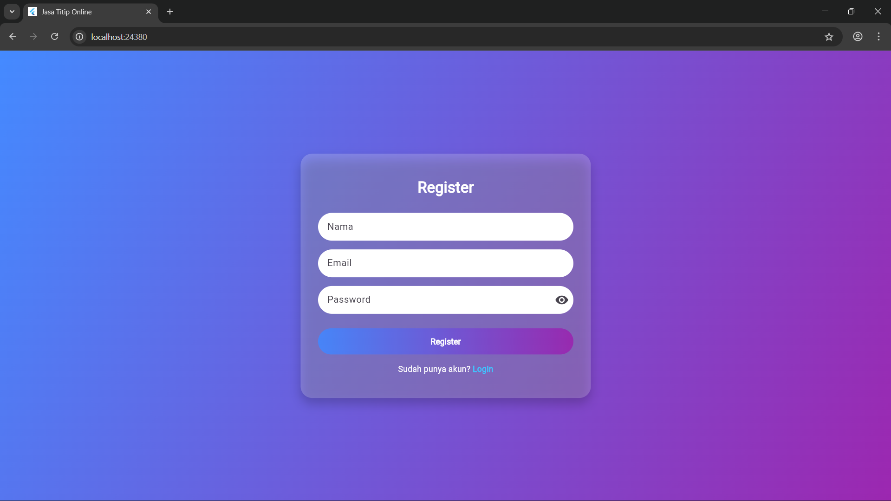
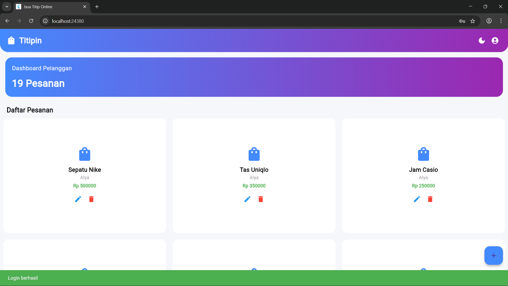
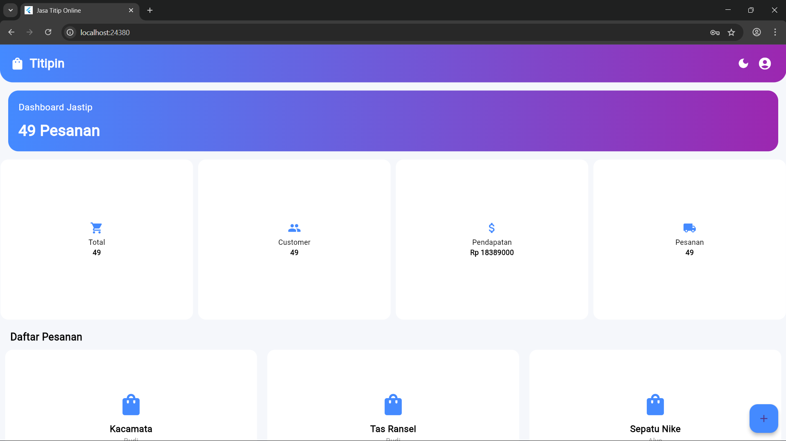
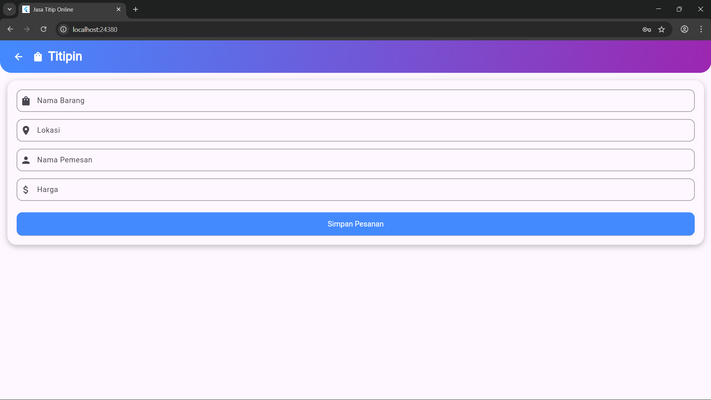
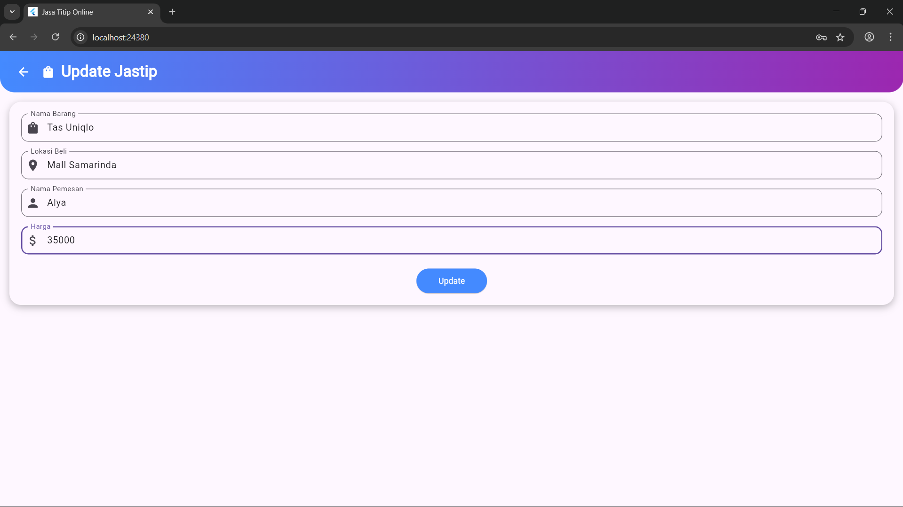

# Jasa titip App

# Deskripsi Aplikasi
Jasa titop App adalah aplikasi mobile berbasis Flutter yang digunakan memfasilitasi jasa titip (jastip) secara Online. Aplikasi ini memungkinkan pengguna untuk menambahkan pesanan titipan, melihat daftar permintaan, memperbarui detail pesanan, serta menghapus pemesanan titipan dengan mudah dan terorganisir.

## Struktur Project

```text
lib/t
|- models/
|  |- items.dart
|  |- order.dart
|
|- page/
|  |- auth/
|     |- login.dart
|     |- register.dart
|  |- dashboard/
|     |- dashboardpelanggan.dart
|     |- dashboard.dart
|  |- jastip/
|     |- create.dart
|      |- update.dart
|
|- main.dart
```

## Fitur Aplikasi

1. Login dan register
   
   Aplikasi ini menyediakan login untuk pengguna lama dan register untuk pengguna baru.
   
2. Create
   
   Pengguna dapat menambahkan pesananan titipan dengan mengisi form input seperti nama barang, lokasi, nama pemesan dan harga.

3. Read
   
   Aplikasi menampilkan daftar pemesanan titipan yang telah dimasukkan.

4. Update
    
   Pengguna dapat mengubah data pemesanan titipan seperti nama barang, lokasi, nama pemesan dan harga

5. Delete
    
   Pengguna dapat menghapus data pemesanan titipan.

6. Multi Page Navigation
    
   Aplikasi memiliki beberapa halaman:
   - Halaman Utama (Dashboard)
   - Halaman Tambah pesanan titipan
   - Halaman Update pesanan titipan

7. Dark dan light mode
   Aplikasi menyediakan dua mode tampilan yaitu dark mode dan light mode yang dapat digunakan oleh pengguna.

## Widget yang Digunakan

- MaterialApp
- Scaffold
- AppBar
- GridView
- TextField
- ElevatedButton
- FloatingActionButton
- Navigator
- ConstrainedBox
- GestureDetector
- AlertDialog   
- CircularProgressIndicator
- OutlineInputBorder
- FilteringTextInputFormatter

## Simulasi Aplikasi

### Login



Ketika aplikasi dijalankan, pengguna diminta menginput email dan password. Jika baru pertama kali, pengguna mengklik sign up dan akan menuju halaman register.

### Register



Dihalaman register, pengguna akan diminta menginput nama, email dan password yang benar dan jika berhasil akan masuk ke dashboard pelanggan.

### Dashboard 

#### Dashboard Pelanggan 

Jika pengguna berhasil login sebagai pelanggan maka,



Mempunyai dashboard sendiri yaitu barang yang dia titipin, bisa create, update dan delete barang titipannya.

#### Dashboard Admin

jika pengguna berhasil login sebagai admin maka,



Mempunyai dashboard admin terdiri dari informasi titipan, pendapatan, berapa pesanan, daftar pesanan seluruh pelanggannya, create pesanan, update pesanan, delete pesanan.   

### Create

Jika pengguna ingin memesan barang titipan dengan cara,



Pada halaman create, pengguna diminta nama barang, lokasi, dan nama pemesanan dan harga. 

### Update

Jika pengguna ingin mengupdate barang titipan nya



Pada halaman update, pengguna diminta nama barang, lokasi, dan nama pemesanan dan harga jika ingin diupdate. kalau ada perubahan otomatis ke update dan jika tidak ada perubahan maka tidak ada perubahan.

### Delete

Jika pengguna ingin delete barang titipannya 


Tinggal klik icon sampah untuk delete barang titipannya dan ada notifikasi apakah yakin ingin menghapusnya ?, jika ingin maka terhapus dan jika tidak maka tidak terhapus.

### 


   
  
